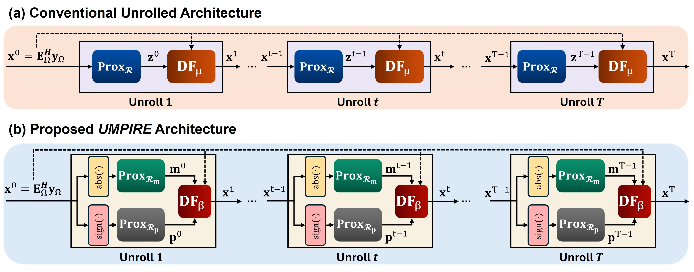
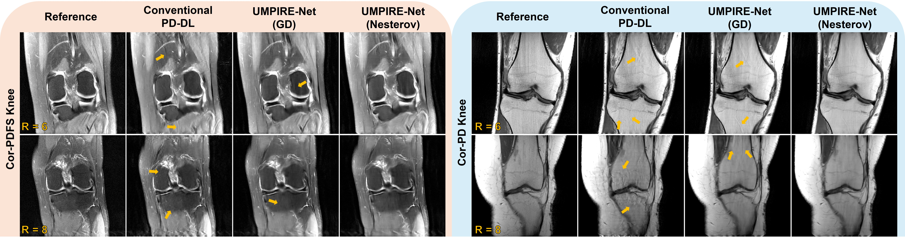

# UMPIRE-Net: Unrolled Magnitude–Phase Regularization Network for Accelerated MRI

<p> <a href="https://arxiv.org/abs/2608.14422">  </a> </p>

<p align="center">
  
</p>


## Abstract
<p align="justify">
MRI reconstruction from undersampled k-space is an ill-posed inverse problem. Physics-driven deep learning (PD-DL) addresses this problem by integrating the MRI forward model with learned regularization in algorithm-unrolling frameworks. However, most PD-DL methods reconstruct complex-valued images directly, implicitly coupling magnitude and phase within a single learned representation. This can be limiting in settings requiring accurate phase modeling, such as partial Fourier (PF) imaging, where recovery of omitted asymmetric k-space data depends on image phase. We propose UMPIRE-Net (Unrolled Magnitude-Phase In REgularization Network), a PD-DL method with separate learned magnitude and phase regularizers and a novel data-fidelity formulation that enforces measurement consistency, reducing reliance on externally estimated phase. Across multiple datasets and acceleration factors, UMPIRE-Net outperforms a conventional complex-valued PD-DL baseline, producing sharper images with fewer artifacts.
</p>
<p align="center">
  
</p>

## Repository Structure

```text
UMPIRE-Net/
├── config/
│   └── Config.yaml
├── src/
│   ├── unet
│   ├── DC.py
│   ├── DataLoader.py
│   ├── Unrolled_Network.py
│   └── Utils.py
├── train.py
├── test.py
├── run_all_train.sh
└── run_all_test.sh
```

## Quick Start
**Note:** This code was tested with `torch==2.2.1+cu121`.

### 1. Clone this repository

```bash
git clone https://github.com/MahdiSaberii/UMPIRE-Net.git
cd UMPIRE-Net
```

### 2. Create and activate conda environment

```bash
conda create -n umpire-net python=3.10 -y
conda activate umpire-net
```

### 3. Install requirements

```bash
pip install torch==2.2.1+cu121 --index-url https://download.pytorch.org/whl/cu121
pip install -r requirements.txt
```

## Running the Experiments

To run all CorPD and CorPDFS experiments, place `run_all_train.sh` and `run_all_test.sh` in the repository root. First, make the scripts executable and launch training. After training is complete, run the testing script, which automatically selects the latest available best-validation checkpoint for each experiment.

```bash
chmod +x run_all_train.sh run_all_test.sh
./run_all_train.sh
./run_all_test.sh
```


## 📝 BibTeX

If you find this repository useful in your research, please consider citing our work:
```bibtex
@inproceedings{saberi2026umpire,
  title={UMPIRE-Net: Unrolled Magnitude--Phase Regularization Network for Accelerated MRI},
  author={Saberi, Mahdi and Kilic, Toygan and Ak{\c{c}}akaya, Mehmet},
  booktitle={Proc. IEEE Int. Workshop Mach. Learn. Signal Process. (MLSP)},
  year={2026}
}
```
